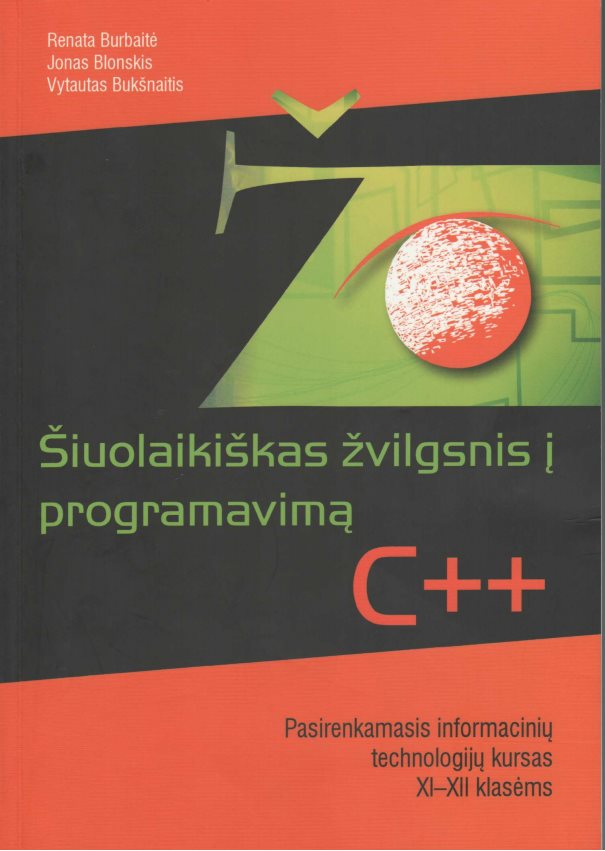

# Kaip pasiruošti informacinių technologijų valstybiniam brandos egzaminui?

Iki valstybinių brandos egzaminų liko vos pusmetis, tačiau tikriausiai jau daugelis abiturientų žino kur norėtų studijuoti ir kokių egzaminų gali prireikti. Galbūt kai kurie iš jūsų laikys informatikos valstybinį brandos egzaminą ir jeigu dar nepradėjote mokytis, laiko pasiruošti vis dar yra!

## Kas sudaro informacinių technologijų valstybinį brandos egzaminą?

Informacinių technologijų egzaminą sudaro 4 pagrindinės dalys:

* Saugus ir teisėtas informacijos ir interneto naudojimas (testas) (maksimalus įvertinimas – 10 taškų).
* Tekstinių dokumentų maketavimas (Microsoft Word) (maksimalus įvertinimas – 20 taškų).
* Skaitinės informacijos apdorojimas skaičiuokle (Microsoft Excel) (maksimalus įvertinimas – 20 taškų).
* Programavimas (Pascal arba C++) (maksimalus įvertinimas – 50 taškų).

Egzaminą išlaikyti galima ir nemokant programuoti, nes pilnai pakanka teorinių žinių apie autorines teises, naršymą internete, saugą ir panašius dalykus, bei mokėti atlikti užduotis su MS Word ir MS Excel. Arba atvirkščiai – jei mokate programuoti, tai visai nebūtina atsakinėti į klausimus ir daryti formuotų pastraipų su MS Word ar įvairių lentelių su MS Excel. Žinoma, pats geriausias variantas būtų pasiruošti abiejoms egzamino dalims ir išlaikyti kuo geriau.

## Saugus ir teisėtas informacijos ir interneto naudojimas (testas)

Ši dalis susideda iš 7 lengvų testinių klausimų. Vienintelis kirtis, kuris gali būti – sulietuvinti terminai, nes dažnas žmogus moka angliškus terminus, tačiau kai pamato lietuvišką iškart pasimeta. Šiai egzamino daliai galima pasiruošti per kelias valandas, arba per 1-2 dienas. O galbūt jūs esate pasiruošęs, tik to nežinot?

Teorinę medžiagą iš ko ruoštis šiems klausimams turėtumėte gauti iš informatikos mokytojo. O jeigu egzaminui bandot pasiruošti savarankiškai, arba jūsų informatikos mokytojas negali suteikti reikiamos informacijos – mokomosios medžiagos pilna internete. Vienu ar kitu atveju, šią medžiagą patarčiau suprasti, o ne iškalti. Klausimai bus susiję su naršymu internete, virusais, antivirusinėmis programomis, ugniasienėmis, elektroninias parašais, licenzijomis, slaptažodžiais, elektroniniu paštu, internetiniais tinklaraščiais, socialiniais tinklais.

Tiesiog peržiūrėkite kokie klausimai būdavo ankstesnių metų egzamino užduočių lapuose. O jei dar nesijaučiat tvirtai, štai keletas šaltinių, kuriuos suradau:

* [http://liuokaitis.lt/egzaminai](http://liuokaitis.lt/egzaminai)
* [https://sites.google.com/site/pamokumedziaga/courses/iii-klase/saugus-ir-teisetas-informacijos-ir-interneto-naudojimas](https://sites.google.com/site/pamokumedziaga/courses/iii-klase/saugus-ir-teisetas-informacijos-ir-interneto-naudojimas)
* [https://prezi.com/ccbjafjkaczq/saugus-ir-teisetas-informacijos-ir-interneto-naudojimas/](https://prezi.com/ccbjafjkaczq/saugus-ir-teisetas-informacijos-ir-interneto-naudojimas/)
* [http://technologijos.jimdo.com/11-klas%C4%97/saugus-ir-teis%C4%97tas-informacijos-ir-interneto-naudojimas/](http://technologijos.jimdo.com/11-klas%C4%97/saugus-ir-teis%C4%97tas-informacijos-ir-interneto-naudojimas/)

Taip pat, galite pamėginti išspręsti šį testą: [http://ragaine.su.lt/tests/saugus.htm](http://ragaine.su.lt/tests/saugus.htm)

## Tekstinių dokumentų maketavimas (Microsoft Word)

Šioje dalyje jūsų lauks 6-7 užduotys, kurios bus susijusios su puslapio ir įvairių elementų formatavimu. Šios užduotys nėra sunkios ir jas galima išmokti vos per kelias dienas.

Šiai egzamino daliai turite mokėti kurti ir formatuoti:

1. Kelių lygių sąrašus.
2. Lenteles.
3. Dokumento išskaidymą.
4. Puslapių lūžius.
5. Nuorodas.
6. Puslapinės antraštes ir poraštes.
7. Puslapių numeravimą.
8. Simbolių, antraščių ir pastraipų stilių.
9. Tabuliavimo žymes.
10. Dalykines rodykles.
11. Puslapio turinį.

Medžiagą mokytis jums turėtų suteikti jūsų informatikos mokytojas, tačiau jeigu jis jums negali padėti, arba mokotės savarankiškai, paruošiau šį dokumentą iš kurio galite pasimokyti: [./](Tekstinių dokumentų maketavimas).

Būtinai įgytas žinias užtvirtinkite pasispręsdami ankstesnių metų egzaminų užduotis.

## Skaitinės informacijos apdorojimas skaičiuokle (Microsoft Excel)

Ši egzamino dalis yra verta tiek pat kiek ir tekstinių dokumentų maketavimo dalis, tačiau visos užduotys atliekamos ne su Microsoft Word programa, o su Microsoft Excel.

Reikia mokėti:

* Naudoti matematines ir trigonometrines, statistines, datos laiko funkcijas (abs, sin, cos, pi, round, sumif, trunc, count, countif, today, date).
* Naudoti logines funkcijas (if, and, or ir not).
* Formulėse naudoti santykį nes, absoliučiąsias ir mišriąsias langelio koordinates, taip pat, mokėti užrašyti sudėtingesnes formules skaičiavimams atlikti.
* Rikiuoti duomenis lentelėje pagal kelis raktus.
* Atrinkti (filtruoti) duomenis pagal skirtingas sąlygas (kriterijus).
* Vaizduoti duomenis diagramomis, juos analizuoti (stulpelinė, juostinė, skritulinė, linijinė, taškinė diagramos; keisti diagramos elementų parametrus: legenda, spalvos, dydžiai, rėmeliai ir pan.).
* Nustatyti spausdinamo dokumento nuostatas, įdėti puslapines antraštes, poraštes (paraščių dydis, padėtis (stačias, gulsčias), puslapinės antraštės ir poraštės, dokumento peržiūra prieš spausdinimą, dokumento spausdinimas).

Tekstinio dokumento maketavimo dalyje beveik viską buvo galima atlikti pasinaudojant įrankiais esančiais pagrindinėse įrankių juostose. Šioje dalyje yra vienas kitas dalykas, kurį reikės mokėti rasti iš, pavyzdžiui, daug įvairių funkcijų sąrašo. Todėl pasiruošti šiai egzamino daliai gali užtrukti šiek tiek ilgiau. Internete yra informacijos kaip naudotis vienomis ar kitomis Microsoft Excel funkcijomis. Aš deja, neparengiau jokio dokumento su visais paaiškinimas, tačiau, jeigu labai reikės, galiu paruošti.

## Programavimas (Pascal arba C++)

Skamba baisiai? O be reikalo. Investavus kiekvieną savaitę bent po 1-2 valandas tikrai įmanoma pasiruošti programavimo užduotims. Žinoma, kuo daugiau laiko skirsit mokantis mokykloje per informatikos pamokas ir namie savarankiškai, tuo lengviau bus egzamino metu. Jo metu būna dvi užduotys, kurias reikia išspręsti:

* Pirmoji – lengvesnė, nes nereikia naudoti struktūrų, dažniausiai užtenka paprastų kintamųjų, galbūt masyvų ir vieno ar daugiau paprastų algoritmų.
* Antroji – sunkesnė, nes joje jau reikia naudoti struktūras, būtinai funkcijas ir ją išspręsti paprastai užtrunka daugiau laiko nei pirmąją, todėl lengva pridaryti daugiau klaidų.

Abiejose užduotyse teks pradinius duomenis nuskaityti iš duomenų failo bei juos kur nors saugoti: į masyvus arba objektus (o objektai aprašomi struktūrose). Tuomet reikės sugalvoti vieną ar daugiau algoritmų, kurie suskaičiuos viską ko prašo sąlyga. Bei išvesti rezultatus į atskirą rezultatų failą. Visa tai galite atlikti su viena iš dviejų pasirinktų programavimo kalbų (C++ arba Pascal).

### Taigi, nuo ko pradėti?

Reiktų pradėti nuo programavimo kalbos išsirinkimo ir jos pagrindų išmokimo. Aš patarčiau mokytis C++ programavimo kalbą ir net nesvarstyt Pascal varianto, nes Pascal jau niekur nebemokomas ir nebenaudojamas. Įstoję į aukštąją mokyklą, kurioje yra programavimas jūs tikrai nerasite Pascal ir labai tikėtina, kad joje jums lieps mokytis C, C++, C# ar panašią programavimo kalbą. Nuo to laiko kai buvo sukurtas Pascal labai daug kas pasikeitė – kalbos stipriai patobulėjo, tad šiuo atveju C++ yra žymiai panašesnis į šiuolaikines programavimo kalbas nei Pascal. O be to, jums vistiek vėliau reikės mokytis C++ ar ką nors iš tos pačios kalbų grupės kaip C++, pavyzdžiui C, C#, Java, PHP ir panašiai. Kam tada mokytis Pascal, jei iš jo jokios naudos ir jūs jo daugiau gyvenime nebesutiksit?

### Programavimo pagrindai

Aš esu parengusi didelį C++ pamokų kursą. Visas kursas suplanuotas taip, kad nereiktų blaškytis pirmyn atgal tarp skirtingų temų. Kiekviena pamoka sudaryta iš video pamokos, programos kodo ir užduočių. Kursą rasite šiuo adresu: [https://www.youtube.com/playlist?list=PLKofrzwSXUn1TY5FtZRiyx3RZnNF3REBc](https://www.youtube.com/playlist?list=PLKofrzwSXUn1TY5FtZRiyx3RZnNF3REBc)

Prieš laikant egzaminą reikės suprast ir išmokt kas yra:

1. Kintamieji (int, double, string, char, bool…).
2. Įvedimas, išvedimas (cin, cout).
3. Patikrinimo sąlygos (if, switch).
4. Ciklai (for, while).
5. Masyvai (vienmačiai, dvimačiai).
6. Funkcijos (void, int, double, string…).
7. Darbas su duomenų failais (ifstream, ofstream).
8. Struktūros (struct, reikia tik antroje programavimo užduotyje).

### Užduočių sprendimas

Visą laikotarpį iki egzamino reikia spręsti kaip įmanoma daugiau užduočių. Kuo daugiau savarankiško darbo – tuo geriau. Ir neklausinėkit mokytojo kaip spręsti iškilusias problemas, jei prie tos problemos nepraleidot bent keletos valandų iš eilės, nes egzamine jums niekas nepadės. Tačiau kas savaitę ar dvi galite pasitikslinti ar mokotės tinkama linkme. Vos tik kai pradėsit mokytis programavimo pagrindus, būtinai spręskit ir savo susigalvotas užduotis. Pavyzdžiui, išmokot susikurti kintamąjį ir supratot kaip į konsolę išvesti informaciją – išveskit vartotojo įvestą kintamąjį į konsolę. Išmokot duomenis nuskaityti iš failo – išveskit tuos pačius duomenis, bet suformatuotus šiek tiek kitaip į kitą failą. Išmokot for ciklą – daug kartų išveskit tą patį sakinį, tik kiekvieną kartą jame ką nors pakeisdami. Ir taip toliau. Tai tik sustiprins jūsų žinias ir išmoktų pagrindų nebeužmiršite tą pačią dieną. O ir egzamino dieną jums bus svarbiau sugalvot tinkamus algoritmus, kurie turės apskaičiuot tam tikrą dalyką, tad jūsų galvoje tuomet neturėtų būti klausimo „kaip tai aprašyti?“. Sintaksę turit mokėt taip stipriai, kad naktį pakėlus jūs galėtumėt aprašyt bet ką. Egzamino dieną nebus laiko bandyt prisimint kaip apsirašo vienas ar kitas dalykas, teks galvoti algoritmus.

Taip pat, visai neblogų užduočių rasite knygoje „Šiuolaikiškas žvilgsnis į programavimą (XI-XII kl.) C++“, kurią parašė Renate Burbaitė, Jonas Blonskis ir Vytautas Bukšnaitis.

### Nuoseklumas mokantis

Dar ko nepaminėjau, tai – nuoseklumas, tiek ką mokantis, tiek kada mokantis. Geriausiai mokytis ta eilės tvarka ką surašiau prieš tai (pradedant nuo kintamųjų, baigiant struktūromis), taip bus mažiau blaškymosi. Dėl mokymosi „kada“ patarčiau išsirinkti savaitės dieną ir laiką, kurią galit ir norit mokytis, bei atsarginę dieną, jei pirmąją negalėsit dėl kokių nors priežasčių. Ir būtinai laikykitės tokio režimo, nes programavimo mokymasis yra lygiai tas pats kas užsienio kalbos mokymasis – per dideli intarpai tarp pamokų ir jau nebeprisimenat nieko iš ankstesnių pamokų, o per vieną daug ilgesnę pamoką nebeįmanoma atidirbt už ankstesnes pamokas. O be to, tokio režimo laikymasis galiausiai duos daug didesnės naudos, pavyzdžiui, jums bus lengviau prisiverst prisėst, nes nebus galvoje minties „oi kiek daug reikia išmokt, kaip tingiu“. Pamatysit, kad mokantis po truputį tiek daug nepavargsit ir galiausiai su mielu noru sėsit prie „CodeBlocks“.

### Planas

Tai taip pat svarbu kaip ir mokymasis nustatytą dieną. Negalima sėdėt prie vieno ir to pačio dalyko kokį mėnesį. Būtina greitai daryti progresą, net jei atrodo, kad dar yra daug laiko. Ir patikėkit, neatidirbus namie, egzamine tikriausiai patirsit stresą, kuris jums yra priešas numeris vienas. Taigi, planas būtų toks, kad programavimo pagrindų ir sintaksės išmokimui skirkite ne daugiau nei 20 % viso savo laiko, o kuo mažesnis tas skaičius bus – tuo geriau, nes daugiau laiko galėsite skirti užduotims. Pavyzdžiui, turite 5 mėnesius iki egzamino, tai pagrindus turite išmokti per mėnesį, o visą likusį laiką reikia skirti užduotims su kuriomis bus daug sunkiau.

Galim paskaičiuot, kad susidarytumėte šiokį tokį vaizdą dėl mokymosi plano. Jau tikriausiai aišku kiek laiko reikia skirti pagrindams (šiuo atveju mėnesis), o jums reikia išmokti 8 dalykus (išvardinti aukščiau) ir tarkime per savaitę prisėdat vieną kartą, tai per mėnesį 4 kartus. Pirmi 4 dalykai yra lengvesni už 4 paskutinius, todėl preliminarus planas būtų toks:

* Pirma savaitė – kintamieji, įvedimas/išvedimas, patikrinimo sąlygos, ciklai.
* Antra savaitė – masyvai, funkcijos.
* Trečia savaitė – darbas su duomenų failais.
* Ketvirta savaitė – struktūros.

Tačiau viskas yra labai individualu, todėl čia tik plano pavyzdys, kuris ne visada bus tinkamas visiems. Jei tarkime vienas abiturientas pirmą savaitę išmoks kintamuosius, įvedimus, išvedimus, patikrinimo sąlygas, ciklus ir nesijaus pavargęs, o kaip tik priešingai – labai susidomėjęs ir susikaupęs, tai tokiu atveju galima pasimokyti ir į priekį – masyvus ir/ar funkcijas. O jei bus priešingai, galbūt per savaitę reiktų skirt ne vieną kartą mokslams, o du ar daugiau? Taip per mėnesį pasimokysite nebe 4 kartus, o 8. Būtinai taip planuokite savo laiką.

Išmokę pagrindus nepulkite daryti egzamino užduočių, nes jos dar gali pasirodyti per sunkios ir varyti į neviltį (priešas numeris du). Skirkite kelias pamokas šiaip užduočių pasprendimui. Pamėginkite iš failo nuskaityti įvairiai surašytus duomenis, tiek kai žinote kiek yra duomenų, tiek kai nežinote kiek yra duomenų. Pamėginkite tuos duomenis sudėti į struktūrų objektus, atlikti kokius nors skaičiavimus su jais. Pasimokykite masyvų rikiavimo. Padarykite įvairesnių tipų funkcijų skirtingiems dalykams. Pamėginkite susigalvoti tokias užduotis, kuriose galėtumėte panaudoti kaip įmanoma daugiau visko ko išmokote. Ir tik kai jausitės, kad jums gaunasi – sėskitės prie ankstesnių metų egzaminų užduočių.

## Nepervarkite

Jeigu jaučiat, kad nebesigalvoja ir nebegalite tęsti pamokos – būtinai sustokite, nebesikankinkite. Padarykite pusvalandžio pertrauką ir grįžkite, arba tai dienai tiesiog baikite. Nuo savęs kankinimo tikrai nebus geriau, nes tai žlugdo motyvaciją mokytis (priešas numeris trys).

## Egzamino dieną

Šiam egzaminui galioja tokie patys patarimai kaip ir laikant kitus egzaminus. Visų pirma, jei kažko nežinote – nesėdėkit ir negaiškite laiko, eikite toliau, nes tikrai neverta likti prie uždavinio, kurio sprendimo ar atsakymo tuo metu neatsimenate. Antra, tai ką tikrai mokate padarykite kuo greičiau, kad turėtumėte daugiau laiko užduotims, kurioms reikia daugiau laiko ar pagalvojimo. Trečia, jeigu liko laiko – išspręskite tas egzamino dalis, kurių neatsakėte (jeigu iki šio laiko atsiminėt atsakymą – žymėkit jį, jeigu ne – žymėkit pirmą į galvą šovusį galbūt teisingą atsakymą) ir būtinai pasitikrinkite tai ką išsprendėt anksčiau! Sėkmės egzamine! :)

